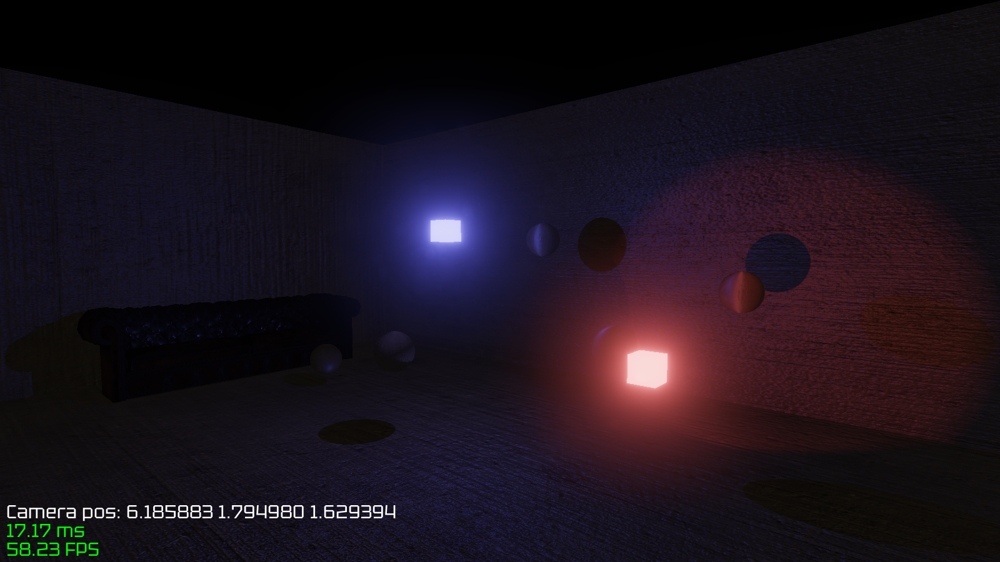
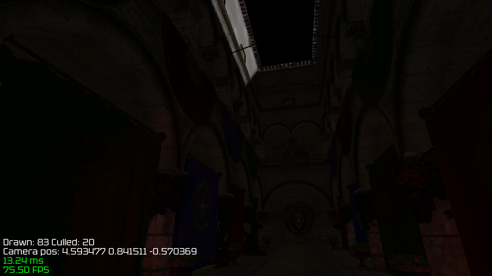

# OpenglFPS

## Build
`./dependencies.bash`  
`premake5 gmake2`  
`make`. Use `make config=release` to build in release mode.  

## Run
`Bin/Debug/RaylibFPS` or `Bin/Release/RaylibFPS`

## Images

